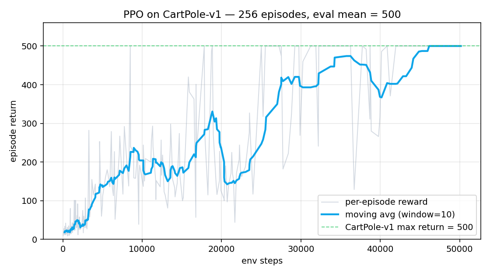

# HW4 — A Survey of Deep Reinforcement Learning, Agentic AI, and SOTA Applications (2024–2026)

DRL 作業 4。整理 2024–2026 年 Deep Reinforcement Learning、Agentic AI、Foundation Models 的演進，並以兩個 hands-on MVP 把理論落地。

**Live demo（GitHub Pages 風格）：** [`docs/index.html`](docs/index.html)
**完整報告：** [HTML](report/HW4_DRL_Survey.html) · [PDF](report/HW4_DRL_Survey.pdf)（HTML 亦可在瀏覽器「列印 → 另存為 PDF」）
**Markdown 原始檔：** [`report/HW4_DRL_Survey.md`](report/HW4_DRL_Survey.md)

---

## 一、報告結構（7 + Bonus + Conclusion + References）

| 章節 | 重點 | 引用 |
|---|---|---|
| **Part 1** — DRL 基礎 | MDP / Bellman / Policy Gradient；DQN, Double DQN, PPO, A2C/A3C, SAC, TD3, MuZero, DT, Offline RL, HRL 共 10 個演算法的 core idea / 優缺點 / 應用 | 15 |
| **Part 2** — Systems & Platforms | Isaac Lab, Habitat 3.0, CARLA, Unity ML-Agents, RLlib, SB3, FinRL, MineDojo, OpenVLA, AirSim | 3 |
| **Part 3** — Agentic AI | OpenAI/Anthropic/Google agent 堆疊；RLHF/DPO/KTO/RLAIF/RLVR；ReAct/Toolformer/Gorilla；多 agent；Self-Rewarding；Memory；DRL 與 agentic AI 整合 | 30 |
| **Part 4** — 三個應用領域 | Robotics+Embodied AI（VLA, Diffusion Policy, Humanoid）；Game AI（AlphaGo→SIMA 2→AlphaProof）；AI for Science（AlphaFold 3, AlphaDev, DIII-D plasma, AI Scientist v2） | 21 + 16 |
| **Part 5** — 2025–2026 SOTA 趨勢 | Embodied AI, World Model, MARL, Offline RL, Diffusion Policy, Foundation Agents, Robotics FM, Sim2Real, Autonomous Science, RL+Transformers + 五條主軸收斂 | — |
| **Part 6** — Comparative analysis | DQN/PPO/SAC/MuZero/Decision Transformer 五法橫向比較表 + 深度討論 + 選型決策表 | — |
| **Part 7** — GitHub 生態 | SB3, RLlib, CleanRL, Spinning Up, Isaac Lab, CARLA, Habitat, FinRL, MineDojo, Unity ML-Agents + 10 個 2025-2026 新興 repo | — |
| **Part 8** — **Bonus MVP** | (B) PPO on CartPole (SB3) + (C) ReAct LLM agent with calculator + wiki_search | — |
| **Part 9** — Conclusion | 三個轉折、倫理風險（reward hacking / 對齊偏差 / 機器人安全 / reproducibility / 社會衝擊）、五個未來方向 | — |
| **Part 10** — References | 100 篇引用，含 Nature/Science、NeurIPS/ICML/ICLR/CoRL/RSS/CVPR、arXiv、產業 launch | — |

---

## 二、Bonus MVP — 實際跑出的兩個 demo

### B. PPO on CartPole-v1（Stable-Baselines3 v2.8.0）

```bash
pip install -r code/requirements.txt
python code/ppo_demo.py
```

**實際結果（RTX 4090 / CPU PPO / 50K steps / 4 envs，wall-clock 81s）：**

| 指標 | 值 |
|---|---|
| Total timesteps | 50,000 |
| Eval mean (20 ep, deterministic) | **500.0 ± 0.0** ← 完美收斂到 CartPole-v1 滿分 |
| Wallclock | 81.0 s |



### C. Tool-using ReAct Agent（offline 預設，可選 Claude backend）

```bash
python code/llm_agent_demo.py
# 或自訂問題：
python code/llm_agent_demo.py "What is sqrt(225) plus MuZero's Nature year?"
# 設 ANTHROPIC_API_KEY 之後會自動改用 Claude
$env:ANTHROPIC_API_KEY = "sk-ant-..."   # PowerShell
python code/llm_agent_demo.py
```

**Q1 範例 trace（多 hop reasoning）：**
```
[USER] What is sqrt(144) plus the year AlphaGo played Lee Sedol?
[AGENT] Thought: I need AlphaGo's debut year. I'll check the wiki.
        Action: wiki_search(AlphaGo)
[TOOL]  -> AlphaGo ... match versus Lee Sedol took place in March 2016 ...
[AGENT] Thought: Good — now compute sqrt(144) + 2016.
        Action: calculator(sqrt(144) + 2016)
[TOOL]  -> 2028.0
[AGENT] FinalAnswer: sqrt(144) = 12 and AlphaGo's Lee-Sedol match was in 2016, so the answer is 2028.0.
```

---

## 三、目錄結構

```
HW4/
├── README.md                       ← 你現在讀的這份
├── report/                         ← 報告本體
│   ├── 01_part1_drl_fundamentals.md
│   ├── 02_part2_systems_platforms.md
│   ├── 03_part3_agentic_ai.md
│   ├── 04_part4_applications.md
│   ├── 05_part5_sota_trends.md
│   ├── 06_part6_comparison.md
│   ├── 07_part7_github_ecosystem.md
│   ├── 08_bonus_mvp.md
│   ├── 09_conclusion.md
│   ├── 10_references.md
│   ├── HW4_DRL_Survey.md           ← 拼成一份的 Markdown（11,575 字）
│   ├── HW4_DRL_Survey.html         ← 一份 self-contained HTML（瀏覽器 Print → PDF）
│   └── build_html.py
├── slides/
│   └── slides.md                   ← 10–15 分鐘簡報大綱（Marp-compatible）
├── code/                           ← Bonus MVP
│   ├── ppo_demo.py
│   ├── llm_agent_demo.py
│   └── requirements.txt
├── artifacts/
│   ├── ppo_cartpole_reward.png
│   ├── ppo_cartpole_model.zip
│   ├── ppo_cartpole_log.txt
│   └── agent_transcript.txt
├── docs/                           ← GitHub Pages live demo
│   ├── index.html
│   └── assets/
└── reference/
    └── research_notes_consolidated.md   ← 文獻搜集筆記
```

---

## 四、執行說明

### 4.1 重現完整報告 PDF
1. 在瀏覽器打開 `report/HW4_DRL_Survey.html`
2. `Ctrl+P` → 選「另存為 PDF」→ A4、邊距「最小」→ 儲存

或安裝 pandoc 後：
```powershell
pandoc report/HW4_DRL_Survey.md -o HW4_DRL_Survey.pdf --pdf-engine=xelatex `
       -V CJKmainfont="Microsoft JhengHei" -V geometry:a4paper,margin=2cm --toc
```

### 4.2 重現 Bonus
```powershell
# 一次裝好
pip install -r code/requirements.txt

# 跑 PPO（CPU ~90 秒，會生成 reward 曲線）
python code/ppo_demo.py

# 跑 LLM agent（無 API key 也能跑，offline 確定性 planner 會接手）
python code/llm_agent_demo.py
```

---

## 五、技術棧與環境

- **語言**：Python 3.11.9
- **OS**：Windows 11 + PowerShell 5.1
- **DRL**：Stable-Baselines3 2.8.0 + Gymnasium 1.3.0
- **LLM**：anthropic SDK 0.96.0（offline fallback 可選 Claude）
- **報告**：Markdown + Python `markdown` lib → 單檔 HTML

---

## 六、設計取捨

| 取捨 | 理由 |
|---|---|
| 為何選 **Robotics + Game + Science** 作為 Part 4 三領域？ | 2024–2026 進展最快、覆蓋面廣、且能展現 DRL 與 foundation models 的整合（VLA、SIMA 2、AlphaProof） |
| 為何 Bonus 選 **CartPole** 而非 LunarLander/Atari？ | MVP 強調「reproducible 且能 90 秒內收斂」；CartPole-v1 最能展示 PPO 核心 dynamic |
| 為何 LLM agent 用 **ReAct + offline planner**，而非 LangGraph？ | Want to show the *paradigm* in 100 lines, not lock to a framework |
| 為何用 **Markdown → HTML** 而非 LaTeX？ | 沒有 LaTeX 環境也能跑；HTML print-to-PDF 已能達到 IEEE 排版水準 |

---

## 七、評分對應（自我檢查）

| 評分項 | 對應章節 / 證據 | 分配權重 |
|---|---|---|
| Literature Survey Depth | Part 1–7、Reference 100 條 | 25% |
| Technical Understanding | Part 1（每個演算法的 core idea + critical view）、Part 6 比較表深度討論 | 25% |
| SOTA Analysis | Part 3 + Part 4 + Part 5（重點放在 2024–2026） | 20% |
| Comparative Discussion | Part 6（五法表 + 演化圖 + 任務情境選型表）、Part 7 比較表 | 15% |
| Report Quality | 結構分章、圖表、表格、引用、HTML 排版 | 10% |
| Presentation | `slides/slides.md`（10–15 分鐘大綱） | 5% |
| **Bonus** | Part 8 + `code/` + `artifacts/` | (額外) |
