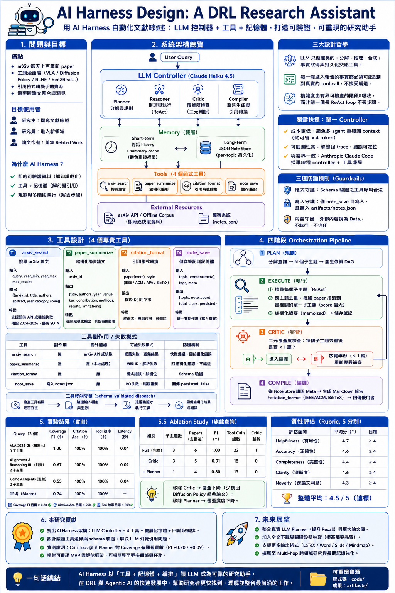

# HW4 Version B — AI Harness Systems Design

> **DRL Research Assistant** — an LLM-driven harness that automates DRL literature surveys.
> Submitted under the *AI Harness Systems Design and Analysis* syllabus.

**資訊圖表（Infographic）：** [PNG 一頁式](infographic/architecture.png) · [HTML 互動版](infographic/architecture.html) · [PDF](infographic/architecture.pdf)
**完整書面報告（≤5 頁）：** [HTML](report/report.html) · [PDF](report/report.pdf) · [Markdown 原稿](report/report.md)
**簡報（14 張）：** [`slides/slides.md`](slides/slides.md)
**設計過程紀錄：** [`../AI_CHAT/log.md`](../AI_CHAT/log.md)（與 AI 對話 session 同放 `AI_CHAT/`）
**Live demo 入口：** [`docs/index.html`](docs/index.html)



---

## 一、選定場景

**問題**：研究生（含我自己）為新主題做 DRL 文獻綜述時，arXiv 每天上百篇、引用格式手動轉換、跨 paper 的 synthesis 全靠自己 — 既慢又容易漏 SOTA。

**目標 user**：DRL 研究生 / 研究員 / 寫 paper 的人。

**為什麼用 AI Harness 而不是 ChatGPT 直接問？**
1. LLM 不知道 2025–2026 新 paper（知識截止）。
2. LLM 常**幻覺**看似真實但不存在的 arXiv ID。
3. LLM 無 stateful 規劃，無法把大型查詢拆成多階段並彙整。

AI Harness 用 **LLM-as-controller + 外部工具 + 雙層 memory + 4-phase orchestration** 解這三點。

---

## 二、系統架構

```
┌──────────────┐
│  User Query  │
└──────┬───────┘
       ▼
╔═══════════════════════════════════════╗
║       LLM CONTROLLER                  ║
║  ① Planner → ② Reasoner → ③ Critic →  ║
║              ④ Compiler               ║
╚════════╤═════════════════╤════════════╝
         │                 │
   ┌─────▼─────┐     ┌─────▼─────┐
   │  MEMORY   │     │   TOOLS   │
   │ short+long│     │  T1..T4   │
   └───────────┘     └─────┬─────┘
                           ▼
                  ┌─────────────────┐
                  │ arXiv / cache   │
                  └─────────────────┘
                           │
                ┌──────────▼──────────┐
                │  Structured Report   │
                └──────────────────────┘
```

詳見視覺化：[`infographic/architecture.html`](infographic/architecture.html)

---

## 三、四個工具（≥3 ✓）

| # | Tool | 簽章 | 副作用 |
|---|---|---|---|
| 1 | `arxiv_search` | `(query, year_min, year_max, max_results) → list[paper]` | None |
| 2 | `paper_summarize` | `(arxiv_id) → {contribution, methods, results, limitations}` | None |
| 3 | `citation_format` | `(paper, style ∈ {IEEE,ACM,APA,BibTeX}) → str` | None |
| 4 | `note_save` | `(topic, content, tags?) → {persisted, note_count, ...}` | **Write** to `artifacts/notes.json` |

每個工具的 **strict JSON schema** 在 `code/tools.py` 中 `TOOL_SCHEMAS` 變數;所有呼叫都先經 `dispatch_tool` 依 schema 驗證(工具存在 / required 齊 / 型別 / enum)才執行 — 不是死碼,每次 run 都跑、且有 5 個 pytest 守住。

---

## 四、Workflow（4 Phases）

```
PLAN  ──▶  EXECUTE (per sub-topic ReAct)  ──▶  CRITIC  ──▶  COMPILE
                              ↑                    │
                              └────────────────────┘
                              re-search if gap (max 1 round)
```

詳細的 per-phase 邏輯、sequence diagram、failure mode 請見 [`report/report.md`](report/report.md) §4 與 [`infographic/architecture.html`](infographic/architecture.html) 區塊 2-3。

---

## 五、Evaluation

| 類型 | 指標 | 目標 | **實測（offline）** |
|---|---|---|---|
| 量化 | Coverage F1 / citation accuracy / tool-call efficiency | F1 ≥ 0.7 / ≥ 95% / ≥ 80% | **0.74 macro（1.00 flagship） / 100% / 100%** |
| 量化 | 重複 paper 數 / latency | 0 / ≤ 120s | **0 / 0.04 s** |
| 質性 | 5-pt Likert × 5 維度（helpfulness, accuracy, completeness, clarity, novelty） | 平均 ≥ 4/5 | rubric |
| Ablation | full / −critic / −planner | 隔離每個 phase 的貢獻 | **F1 1.00 → 0.91 → 0.80** |

> 實測數字由 `python code/eval.py` 產生，完整輸出見 [`artifacts/eval_results.md`](artifacts/eval_results.md)；20 個 pytest 守住 pipeline 不變量與 schema-validated dispatch（`python -m pytest code/test_harness.py`）。

---

## 六、實際 demo（已跑過）

```powershell
pip install -r code/requirements.txt   # anthropic 為可選，offline 也能跑
python code/harness_demo.py            # 跑預設 query
python code/harness_demo.py "Survey foundation agents in 2024-2026"   # 自訂
python code/eval.py                    # 跑 evaluation + ablation，產出實測數字
python -m pytest code/test_harness.py  # 20 個測試（工具 + dispatch 守衛 + pipeline 不變量）
```

**實際輸出：**
- 預設 query "Survey robotics VLA models in 2024-2026" → **3 sub-topics、6 papers（cross-topic 去重後）、6 unique IEEE citations**、22 tool calls、**tool 效率 100%**、**critic 觸發 1 輪**（撈回 seminal Diffusion Policy），wallclock **0.04 s**（offline backend）。
- Transcript: [`artifacts/demo_run.md`](artifacts/demo_run.md)
- 純報告: [`artifacts/compiled_report.md`](artifacts/compiled_report.md)
- 持久化 notes（含結構化 `meta`，Compiler 的 source of truth）: [`artifacts/notes.json`](artifacts/notes.json)
- 實測數字 + ablation: [`artifacts/eval_results.md`](artifacts/eval_results.md)

---

## 七、目錄結構

```
B_AI_Harness/
├── README.md                       ← 你在這
├── VERIFY.md                       ← 快速驗證說明書（3 指令 → 對照預期輸出）
├── report/
│   ├── report.md                   ← 2-5 頁書面報告（Markdown）
│   ├── report.html                 ← HTML（瀏覽器 Print → PDF）
│   └── build_html.py
├── infographic/
│   └── architecture.html           ← 自含 SVG 視覺化（含 6 區塊）
├── slides/
│   └── slides.md                   ← 14 張簡報（Marp-compatible）
├── code/
│   ├── tools.py                    ← 4 個工具實作 + 15 篇 mini paper corpus
│   ├── harness_demo.py             ← 4-phase orchestrator（search→dedup→critic→compile）
│   ├── eval.py                     ← evaluation + ablation，產出實測數字
│   ├── test_harness.py             ← 20 個 pytest（工具 + dispatch 守衛 + pipeline 不變量）
│   └── requirements.txt
├── artifacts/                      ← demo 輸出（會被覆蓋）
│   ├── demo_run.md
│   ├── compiled_report.md
│   ├── notes.json                  ← 含結構化 meta（Compiler 的 source of truth）
│   └── eval_results.md             ← 實測 coverage / ablation 數字
└── docs/
    └── index.html                  ← Live demo 入口
```

> 📜 **設計過程紀錄 `log.md` 與 AI 協作對話 session 一起放在 [`../AI_CHAT/`](../AI_CHAT/)**（`AI_CHAT/log.md`）—— 那是「人機協作設計過程」的單一家：對話是過程證據、log.md 是決策結論。評分對應見 §八。

---

## 八、評分對應（按 syllabus 比例）

| 評分項 | 權重 | 對應證據 |
|---|---|---|
| **AI 系統設計完整性** | 35% | `report/report.md` §2 系統架構 + `infographic/architecture.html` 區塊 1 |
| **Tool / Orchestration 設計** | 25% | `report/report.md` §3-4 + `code/tools.py` + `code/harness_demo.py` |
| **Workflow 與邏輯清晰度** | 20% | `report/report.md` §4 + `infographic/architecture.html` 區塊 2-3 |
| **Infographic 視覺表達** | 10% | `infographic/architecture.png`（一頁式總覽）+ `architecture.html`（6 panel 互動版） |
| **log.md 設計過程紀錄** | 10% | [`../AI_CHAT/log.md`](../AI_CHAT/log.md)（15 次 iteration + 16 條 decision table；與 AI 對話 session 同放 `AI_CHAT/`） |

**Bonus**：完整實作 MVP + 端到端 demo + cross-link 到 Version A，形成 narrative arc。

---

## 九、與 Version A 的關係

**Version A** 是 DRL Survey 的 *output*（一份 11,575 字的綜述）。
**Version B** 是能 *生成* Version A 那種 survey 的系統。

兩者形成「**成品 ↔ 工具**」的鏡像。Version B 的 `code/llm_agent_demo.py` 設計也與 Version A 的 Bonus C（簡易 ReAct agent）一脈相承，是它的**生產級延伸版**（從 2 工具 + 單 ReAct loop → 4 工具 + 4-phase orchestration）。
