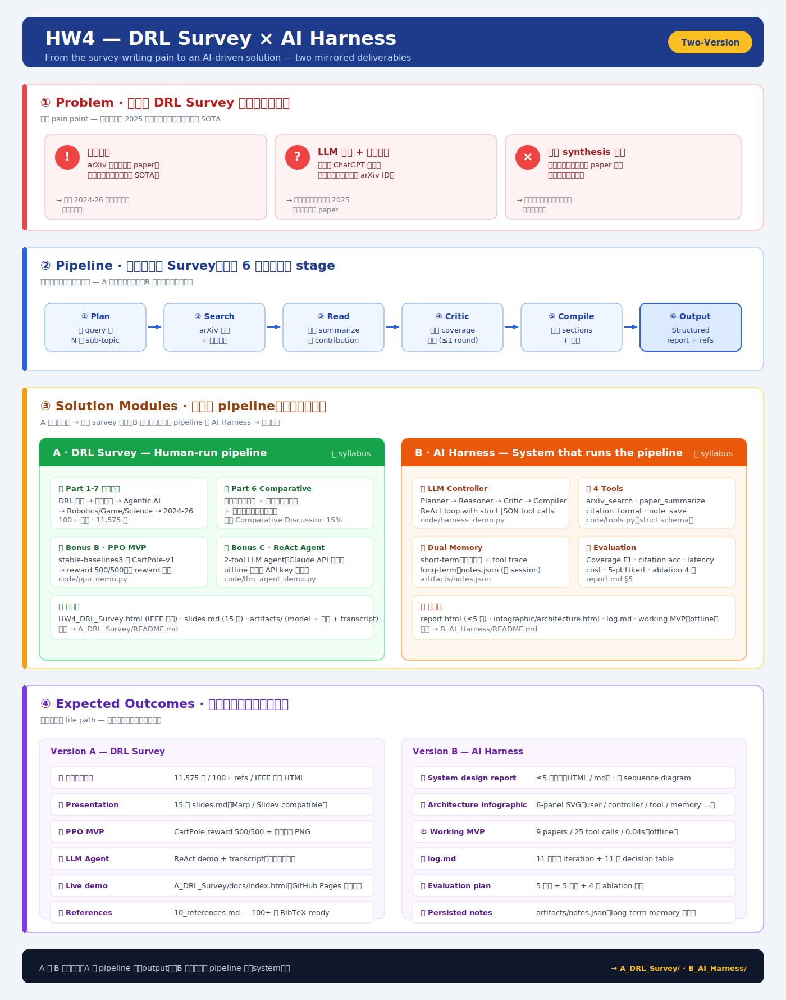

# HW4 — DRL Survey × AI Harness


> 從「寫一份 DRL Survey 為什麼這麼痛」這個問題出發，把流程拆成 pipeline，再用兩種方式交付：
> **A** 親自走完一次 pipeline 產出 survey 成品；**B** 設計能跑這個 pipeline 的 AI Harness 系統。



---

## ① Problem  ·  寫一份 DRL Survey 為什麼這麼痛？

| 痛點 | 具體現象 | 後果 |
|---|---|---|
| **資訊爆量** | arXiv 每天上百篇 paper，人工難判斷哪幾篇是 SOTA | 漏掉 2024–26 五條重要主軸 |
| **LLM 幻覺 + 知識截止** | 直接問 ChatGPT 會編造看似真實但不存在的 arXiv ID | 引用無法驗證；不知 2025 後的新發表 |
| **手動 synthesis 太慢** | 引用格式手動轉、跨 paper 比較全靠自己抄筆記 | 把時間花在排版而非真正讀懂內容 |

---

## ② Pipeline  ·  把「寫 Survey」拆成 6 個可重複的 stage

```
① Plan  →  ② Search  →  ③ Read  →  ④ Critic  →  ⑤ Compile  →  ⑥ Output
拆 query   arXiv 查詢   逐篇        驗證 coverage  合成 sections   Structured
為 sub-    + 年份過濾   summarize    補洞 (≤1 round) + 引用         report + refs
topic                  抓 contribution
```

這是 A 與 B 共同的骨幹。

- **A 版**：人 + Claude 助手 走完一次，產出 11,575 字 survey
- **B 版**：設計成 LLM-driven 自動化系統，6 papers (deduped) / 22 tool calls / 100% efficiency / 0.04 s 跑完同樣 pipeline

---

## ③ Solution Modules

### A · DRL Survey  ·  Human-run pipeline  ([`A_DRL_Survey/`](A_DRL_Survey/))

| 模組 | 內容 | 對應檔案 |
|---|---|---|
| 📚 **Part 1–7 文獻綜述** | DRL 基礎 → 系統平台 → Agentic AI → Robotics/Game/Science → 2024-26 五主軸 | `report/01_*.md` ~ `07_*.md` |
| 📊 **Part 6 Comparative** | 演算法演化譜系 + 系統平台比較表 + 應用領域橫向比較 | `report/06_part6_comparison.md` |
| 🎯 **Bonus B · PPO MVP** | stable-baselines3 訓 CartPole-v1，reward 500/500 + 訓練曲線 | `code/ppo_demo.py` |
| 🤖 **Bonus C · ReAct Agent** | 2-tool LLM agent（Claude API 可選；offline 也能跑） | `code/llm_agent_demo.py` |

### B · AI Harness  ·  System that runs the pipeline  ([`B_AI_Harness/`](B_AI_Harness/))

| 模組 | 內容 | 對應檔案 |
|---|---|---|
| 🧠 **LLM Controller** | Planner → Reasoner → Critic → Compiler 四段；ReAct loop + strict JSON tool calls | `code/harness_demo.py` |
| 🛠 **4 Tools** | `arxiv_search` · `paper_summarize` · `citation_format` · `note_save` | `code/tools.py` |
| 💾 **Dual Memory** | short-term：對話 + tool trace；long-term：跨 session 的 `notes.json` | `artifacts/notes.json` |
| 📐 **Evaluation** | Coverage F1 · citation accuracy · latency · cost · 5-pt Likert · 4 組 ablation | `report/report.md §5` |

---

## ④ Expected Outcomes  ·  可實際拿出來檢驗的成品

### Version A
- 📘 **完整書面報告** — 11,575 字 / 100 refs / IEEE 排版 → [`A_DRL_Survey/report/HW4_DRL_Survey.html`](A_DRL_Survey/report/HW4_DRL_Survey.html)
- 🎞 **Presentation** — 15 張 → [`A_DRL_Survey/slides/slides.md`](A_DRL_Survey/slides/slides.md)
- 🤖 **PPO MVP** — CartPole reward 500/500 + 訓練曲線 → [`A_DRL_Survey/artifacts/`](A_DRL_Survey/artifacts/)
- 🧠 **LLM Agent** — ReAct demo + transcript（offline 可重現）
- 🌐 **Live demo** — [`A_DRL_Survey/docs/index.html`](A_DRL_Survey/docs/index.html)（GitHub Pages 可發佈）
- 🗂 **References** — 100 條 BibTeX-ready

### Version B
- 📕 **System design report** — ≤5 頁書面（HTML / md / PDF）→ [`B_AI_Harness/report/report.html`](B_AI_Harness/report/report.html)
- 🖼 **Architecture infographic** — 6-panel SVG → [`B_AI_Harness/infographic/architecture.html`](B_AI_Harness/infographic/architecture.html)
- 🎞 **Presentation** — 14 張 → [`B_AI_Harness/slides/slides.md`](B_AI_Harness/slides/slides.md)
- ⚙ **Working MVP** — 6 papers (deduped) / 22 tool calls / 100% efficiency / 0.04 s（offline 可跑） → [`B_AI_Harness/code/harness_demo.py`](B_AI_Harness/code/harness_demo.py)
- 📜 **log.md** — 15 次設計 iteration + 16 條 decision table → [`AI_CHAT/log.md`](AI_CHAT/log.md)（與 AI 對話 session 同放 `AI_CHAT/`）
- 📊 **Evaluation（實測）** — macro F1 0.74 / citation 100% / 效率 100% + 3-config ablation → [`B_AI_Harness/artifacts/eval_results.md`](B_AI_Harness/artifacts/eval_results.md)
- ✅ **Tests** — 20 pytest（schema-validated dispatch 守衛 + pipeline 不變量）→ [`B_AI_Harness/code/test_harness.py`](B_AI_Harness/code/test_harness.py)
- 💾 **Persisted notes** — long-term memory 樣本 → [`B_AI_Harness/artifacts/notes.json`](B_AI_Harness/artifacts/notes.json)

---

## 關係圖

> A 與 B 互為鏡像：**A 是 pipeline 的 output**（一份 survey 成品），**B 是能跑這個 pipeline 的 system**（一個能寫 survey 的 AI Harness）。

Version B 的 `harness_demo.py` 是 Version A 中 Bonus C（ReAct LLM agent）的**生產級延伸版**：從 2 工具 + 單 ReAct loop → 4 工具 + 4-phase orchestration。

---

## 附錄

- [`AI_CHAT/`](AI_CHAT/) — 開發過程中的 AI 協作對話紀錄（可追溯佐證）
